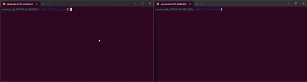

# MiniTalk
<div align="center">

   [](https://github.com/akekesi/minitalk?tab=readme-ov-file#description)
</div>

<div align="center">

   [](https://en.wikipedia.org/wiki/C_(programming_language))
   [](https://en.wikipedia.org/wiki/C_signal_handling)
   [](https://opensource.com/article/18/8/what-how-makefile)
   [](https://en.wikipedia.org/wiki/Shell_script)
</div>

<p align="center">
   <a href="#demo" title="Click to view full-size GIF in Demo section">
      
  </a>
</p>

## Table of Contents
1. [Description](#description)
2. [Demo](#demo)
3. [Prerequisites](#prerequisites)
4. [Usage](#usage)
5. [To-Do](#to-do)
6. [Authors](#authors)
7. [Acknowledgements](#acknowledgements)
8. [License](#license)


## Description
This project was initially developed as an [assignment](docs/minitalk.pdf) for [42 Berlin](https://42berlin.de/de/).  
A UNIX signal-based client-server communication program where the server, upon launch, displays its PID and handles multiple client requests without restarting. Clients send strings to the server using only SIGUSR1 and SIGUSR2 signals, with the server displaying received messages swiftly and acknowledging each one via return signal. Supports Unicode characters.  
🚧 This project is a work in progress. Some features may be incomplete, untested, or lacking full documentation. 🚧

## Demo
<p align="center">
   
</p>

## Prerequisites
🚧 Prerequisites is currently in progress 🚧

## Usage
The Makefile provides the following options for building and cleaning the project:
```
$ make          # Build the main part of the project
$ make bonus    # Build the bonus part (same as the main part)
$ make clean    # Remove object files
$ make fclean   # Remove object files and all executables
$ make re       # Perform 'fclean' and then rebuild the main part
```
### Running the server:
To start the server, execute:
```
$ ./bin/server
```
The server will output its process ID (PID) upon startup.
### Running the client:
To run the client and send a message to the server, use the following command:
```
$ ./bin/client <server_pid> <message>
```
   Where
   - `<server_pid>`: The PID of the server.
   - `<message>`: The message you want to send to the server.
### Example
In one terminal, start the server:
```
$ ./bin/server
server pid: 12345
```
In another terminal, run the client:
```
$ ./bin/client 12345 "Send this message to the server. 🚀"
```


## To-Do
### Notation
- [ ] Task to do
- [x] Task in progress
- [x] ~~Task finished~~

### To-Do

- [ ] Add version
- [ ] Add GitHub Actions ?
- [x] ~~Add badges (C)~~
- [ ] Add badges (Version)
- [ ] Add badges (...)
- [x] Add docstrings (module, class, function)
- [ ] Communication with only one client pid
- [ ] Refactor KISS, DRY
- [ ] Write tests
- [x] ~~Add demo, animation, or video~~
- [x] ~~Add license~~
- [ ] Create a logo for MiniTalk
- [ ] Complete README.md

## Authors
Attila Kékesi

## Acknowledgements
- [42 Berlin](https://42berlin.de/de/)

## License
Code released under the [MIT License](https://github.com/akekesi/minitalk/blob/main/LICENSE).  
This project was initially developed as an [assignment](docs/minitalk.pdf) for [42 Berlin](https://42berlin.de/de/).